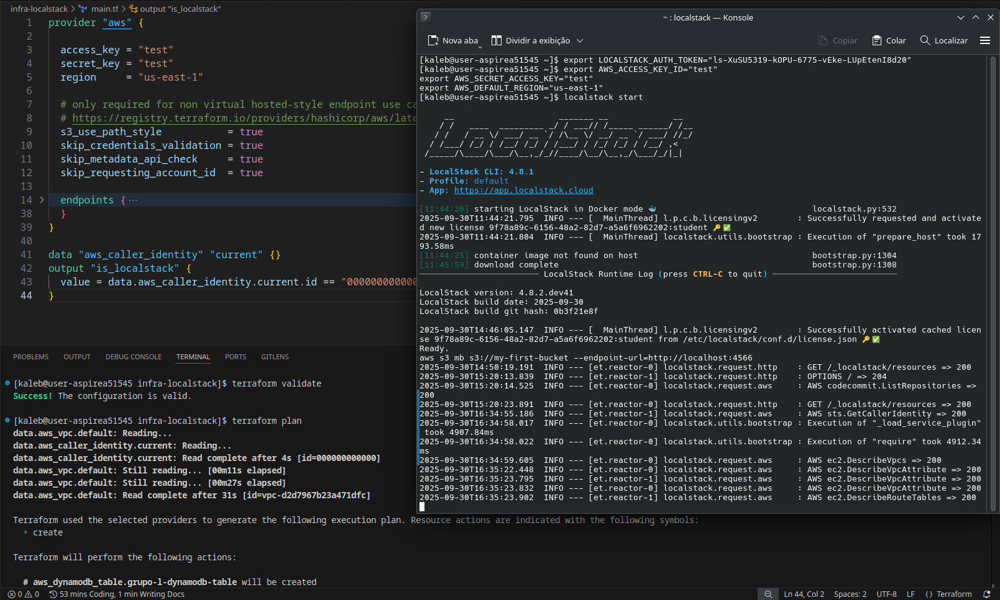

# Utilizando o Localstack

O Localstack é simulador de cloud local, que permite você testar sua infraestrutura, antes de fazer o deploy real para serviços como a AWS.

## Registro no Localstack

1. Realize o registro no [Localstack](https://app.localstack.cloud/sign-in)

* Recomendado, se registrar pelo Github.

2. Após isso, você é encaminhado para a página de Dashboard, **NÃO** é necessário registrar o seu cartão.

* Na opção `localhost.localstack.cloud`, em `Stacks`, você visualiza todos os serviços disponíveis para simulação local.

3. Na aba superior, clicando em `Overview`, poderemos ver todos os serviços ativos, assim que iniciarmos o servidor local.

## Instalar o Localstack

Para a instalação e configuração, siga o passo-a-passo oficial:
https://app.localstack.cloud/getting-started

Nele, você:
1. Realiza o download do Localstack CLI.
2. Configura o token pessoal de acesso.
3. Configura as variáveis de ambiente.

Após isso, provavelmente no 4° passo, você deve executar o Localstack, execute `localstack start`, e verifique que está funcionando.

## Configurando o Terraform

Considerando que você seguiu as etapas até aqui, deve ter instalado na sua máquina:
* Terraform
* AWSCLI
* Docker

**Atenção, para a utilização do Localstack, você NÃO precisa ter a instãncia do AWS Labs ativa.**

1. Vá até o seu local de configuração do terraform, no seu projeto.
2. Localize o arquivo `main.tf`, ou onde se encontra a declaração de `provider "aws"`, do seu terraform.

* Aqui, você provavelmente deve ter a declaração de outros parâmetros, como `aws_ami`, `aws_instance` e/ou `aws_key_pair`. Faça um backup do arquivo, se achar necessário. Delete todas as declarações em `main.tf`, exceto `provider aws`.

3. Altere os parâmetros de `provider aws`, para:
<pre>
provider "aws" {
  access_key                  = "test"
  secret_key                  = "test"
  region                      = "us-east-1"

  s3_use_path_style           = true
  skip_credentials_validation = true
  skip_metadata_api_check     = true
  skip_requesting_account_id  = true
}
</pre>

### Configurando os serviços "aws"

No Localstack, você deve definir quais serviços serão utilizados e incluir em `provider aws {<serviços>}`.

4. Para declarar os serviços a serem utilizados, você habilita a conexão do endpoint do host, essa é a lista com todos os serviços utilizados em aula:

<pre>
provider aws {
    endpoints {
    apigateway     = "http://localhost:4566"
    apigatewayv2   = "http://localhost:4566"
    cloudformation = "http://localhost:4566"
    cloudwatch     = "http://localhost:4566"
    dynamodb       = "http://localhost:4566"
    ec2            = "http://localhost:4566"
    iam            = "http://localhost:4566"
    lambda         = "http://localhost:4566"
    route53        = "http://localhost:4566"
    s3             = "http://s3.localhost.localstack.cloud:4566"
  }
}
</pre>

* *Os demais serviços, podem ser encontrados nas referências listadas*

5. Inclua também em seu `main.tf`, a declaração de chamada de usuário.
<pre>
data "aws_caller_identity" "current" {}
output "is_localstack" {
  value = data.aws_caller_identity.current.id == "000000000000"
}
</pre>

## Realizando o deploy com Terraform

1. Assim como em aula, no terminal, vá até sua pasta de arquivos Terraform.
2. Execute `terraform init`, para iniciar o terraform.
3. Execute `terraform validate`, para verificar que todos os serviços, recebem os devidos parâmetros.
4. Execute `terraform plan`, para realizar o deploy para o localstack.

## Referências

1. Instalação do localstack:
https://app.localstack.cloud/getting-started

2. Localstack - Integração com Terraform (Serviços proporcionados pelo Localstack):
Na seção `Endpoint Configuration`.
https://docs.localstack.cloud/aws/integrations/infrastructure-as-code/terraform/#manual-configuration

